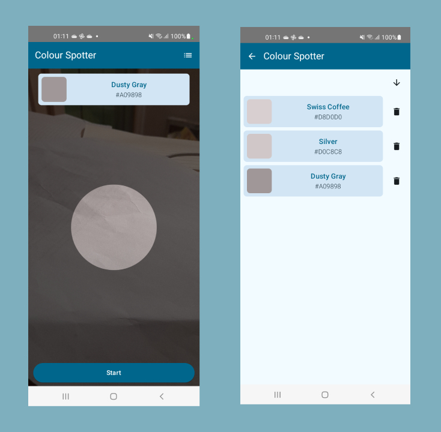

# Colour Spotter App

## Overview

**Colour Spotter** is an Android app that allows users to identify the predominant color of a central portion of the camera feed in real-time.  
Using **CameraX** and **Jetpack Compose**, the app displays a video preview with an overlay that highlights a central area for color selection.  
The user can start the acquisition and obtain the color name, which is determined through a call to an external API.  
The app is designed to demonstrate the use of **CameraX** for video streaming, real-time image processing, and UI management via **Jetpack Compose**.  
It also includes the ability to store acquired colors for later viewing and management.  

The app is based on [Android developers architecture](https://developer.android.com/jetpack/guide?gclsrc=ds&gclsrc=ds)
developed with [Jetpack Compose](https://developer.android.com/jetpack/compose).

## Features

* **Color Identification:** Identify the dominant color
* **Database Integration:** Store and retrieve color palettes using a local database (Room).
* **Dynamic Updates:** The color list automatically updates with database changes.
* **Jetpack Compose:** Built with Jetpack Compose for a modern and declarative UI.
* **Material Design 3:** Adheres to Material Design 3 guidelines for a consistent and user-friendly experience.

## Getting Started
To run the app locally, follow these steps:

1. Clone this repository.
2. Open the project in Android Studio
3. Select build variant *devDebug* in *app* module
4. Build and run the app on an Android emulator or device.

**Requirements:**

-I used Android Studio Ladybug | 2024.2.1 Patch 3  
-I have used a emulator "Pixel 7" to reference with Android api level 35  
-I used a real Pixel 7 with Android 15 api level 35 and a Galaxy A21s with Android 12 api level 32

## Architecture and library used
The app follow this components:
- Project use **MVVM** architecture and Clean architecture;
- divided project in sub-module;
- used Jetpack **Compose** and **Material Design 3**;
- **Retrofit** to request network;
- **Room** to manage database;
- **Flow** to manage change state of data;
- **Hilt/Dagger** for dependency injection;
- **Mockk** to mock data on unit test

## Modularazition
The app follows an implementation of mudularazition by features:
- *app* : main module to run app
- *data* : it contains 'data' layer such as datasource
- *domain* : it contains domain layer such as repository, usecase
- *common* : contains UI models class and utils for general purpose
- *database* : contains utils to manage db, models database and dao;
- *network* : it implements manage network, network models
- *ui* : it contains app theme and custom view;
- *feature/spotter* : 
- *feature/list* : implements list color and owr viewmodel;
- *camera* : implements camera and logic to quantize color

This the graph of dependencies:

## Testing

The project includes unit tests for the network, domain, and data modules. 
You can find them in the respective module directories.

## Screenshots

### Todo
- enable obfuscation code with R8
- implement more unit test. For example in ViewModel